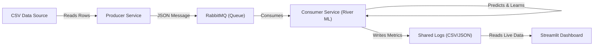

# 🏦 Sistem Analitic Integrat pentru Analiza Churn-ului Bancar

## 📄 Descriere Proiect

Acest proiect reprezintă o lucrare de masterat axată pe elaborarea unui sistem complex de analiză și predicție a fenomenului de **Customer Churn** (migrarea clienților) în domeniul bancar. Proiectul abordează problema din două perspective:

1.  **Cercetare Experimentală (Offline):** Analiza impactului calității datelor (Bias, Noise, Imbalance) asupra performanței și corectitudinii modelelor ML, utilizând tehnici avansate de XAI (Explainable AI).
2.  **Implementare Practică (Real-Time):** Un sistem distribuit bazat pe microservicii pentru predicția și monitorizarea churn-ului în timp real.

-----

## 📂 Structura Repozitoriului

```
├── 📓 notebooks/                   # Laboratoarele de Cercetare
│   ├── 01_EDA.ipynb                # Analiza Exploratorie a Datelor
│   ├── 02_Bias_Fairness_XAI.ipynb  # Simularea Bias-ului și Auditare XAI
│   └── 03_Noise_Overfitting.ipynb  # Analiza Zgomotului și Efectele SMOTE
│
├── 🚀 real-time-churn-app/               # Aplicația de Predicție în Timp Real
│   ├── consumer/                   # Microserviciu ML (River, Online Learning)
│   ├── producer/                   # Simulator de tranzacții bancare
│   ├── dashboard/                  # Interfață vizuală Streamlit
│   ├── data/                       # Dataset-ul sursă
│   └── docker-compose.yaml         # Orchestrarea containerelor
│
├── 📊 data/                        # Date statice (Churn_Modelling.csv)
├── 📝 requirements.txt             # Dependențe Python globale
└── README.md                       # Documentația proiectului
```

-----

## 🔬 Partea I: Cercetare și Experimente (Laboratoare)

Această secțiune conține notebook-uri Jupyter care documentează pașii de analiză și validare a ipotezelor.

### 🧪 Laborator 1: Exploratory Data Analysis (EDA)

  * **Obiectiv:** Înțelegerea distribuției datelor și a corelațiilor.
  * **Rezultate:** Identificarea dezechilibrului claselor (20% Churn) și a factorilor de risc (Vârstă, Geografie-Germania).

### 🧪 Laborator 2: Bias, Fairness și XAI

  * **Obiectiv:** Simularea unui **Bias de Selecție** (eliminarea a 80% din femeile care fac churn) și măsurarea impactului asupra deciziilor modelului.
  * **Tehnici:**
      * **Simulare:** Comparare modele Clean vs. Biased (Logistic Regression, Random Forest, Deep Learning).
      * **XAI:** Utilizarea **SHAP**, **LIME** și a coeficienților pentru a demonstra "orbirea" modelului.
      * **Regularizare:** Testarea impactului L1 (Lasso), L2 (Ridge) și ElasticNet asupra explicabilității.
  * **Concluzie:** Bias-ul din date alterează logica internă a modelului, făcându-l să ignore atributul protejat (`Gender`) chiar și sub regularizare strictă.

### 🧪 Laborator 3: Overfitting, Noise și SMOTE

  * **Obiectiv:** Testarea robusteții modelelor la date "murdare" (Label Noise).
  * **Experimente:**
      * Injectare progresivă de zgomot (5%, 25%, 50%, 75%).
      * Analiza curbelor de învățare (Learning Curves).
      * **Impactul SMOTE:** Demonstrarea faptului că aplicarea SMOTE pe date zgomotoase **scade** performanța (Accuracy & Precision), deoarece amplifică exemplele etichetate greșit.

-----

## 🚀 Partea II: Sistem Real-Time (Microservicii)

Sistemul simulează un flux continuu de date bancare și actualizează un model de învățare incrementală (Online Learning) în timp real.

### Arhitectura Sistemului



### Componente:

1.  **Producer:** Citește setul de date și trimite tranzacțiile una câte una în RabbitMQ.
2.  **RabbitMQ:** Broker de mesaje care asigură decuplarea componentelor.
3.  **Consumer:**
      * Utilizează librăria **`river`** pentru învățare automată online (fără re-antrenare de la zero).
      * Realizează ciclul: *Predicție -\> Extragere XAI (Weights) -\> Antrenare (Learn One)*.
4.  **Dashboard:**
      * Vizualizează în timp real acuratețea, probabilitatea de churn și importanța trăsăturilor.
      * Permite monitorizarea "Live Feed" a clienților procesați.

-----

## 🛠️ Instalare și Utilizare

### 1\. Rularea Laboratoarelor (Local)

Asigurați-vă că aveți Python 3.10+ instalat.

```bash
# Clonare repozitoriu
git clone https://github.com/danielperebinos/UTM-SAD
cd UTM-SAD

# Instalare dependențe
pip install -r requirements.txt

# Pornire Jupyter
jupyter notebook
```

### 2\. Pornirea Sistemului Real-Time (Docker)

Aveți nevoie de **Docker** și **Docker Compose** instalate.

```bash
# Navigare în folderul aplicației
cd real-time-churn-app

# Construire și pornire containere
docker compose up --build
```

### 3\. Accesare Interfețe

După ce containerele au pornit:

  * **📊 Dashboard Streamlit:** Accesați `http://localhost:8501` în browser.
  * **🐰 RabbitMQ Management:** Accesați `http://localhost:15672` (User: `guest`, Pass: `guest`).

-----

## 📈 Concluzii Generale ale Cercetării

  * **Calitatea Datelor \> Complexitatea Modelului:** Un model simplu (Logistic Regression) pe date curate performează mai bine și este mai echitabil decât un Deep Learning pe date biasate.
  * **Pericolul SMOTE:** Augmentarea datelor trebuie făcută doar după o curățare riguroasă. Pe date cu zgomot \>20%, SMOTE degradează sever Precizia.
  * **Transparența este Critică:** Sistemele Real-Time necesită monitorizare continuă nu doar a performanței (Acuratețe), ci și a motivelor decizionale (XAI) pentru a detecta deviațiile (Drift).

-----

## 👤 Autor

**Perebinos Daniel**
Student Masterand | Data Science & Machine Learning

-----

*Proiect realizat folosind managerul de pachete `uv` pentru performanță și reproductibilitate.*