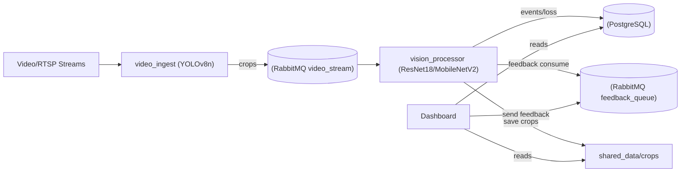

# Multi-Stream Vision App

[](https://www.python.org/)
[](https://www.docker.com/)
[](https://streamlit.io/)
[](https://www.rabbitmq.com/)
[](https://www.postgresql.org/)
[](https://docs.ultralytics.com/)

Distributed CV system: ingest multiple streams, detect people with YOLOv8, classify with transfer learning (ResNet18/MobileNetV2), learn online from feedback, log to PostgreSQL, and monitor via Streamlit.

## Architecture


## Key Features
- Multi-stream YOLOv8n person detection with FPS throttling.
- Transfer learning classifier (ResNet18 default) with frozen early layers; switchable to MobileNetV2.
- Bootstrap training from reference media (`shared_data/reference/me|not_me`).
- Online active learning from dashboard feedback via RabbitMQ.
- Metrics/logging in PostgreSQL; crops on shared disk.
- Streamlit dashboard: analytics, live player, annotation grid, verification gallery.

## Tech Stack
- Python 3.10+, PyTorch, torchvision, ultralytics (YOLOv8), OpenCV
- RabbitMQ + pika
- PostgreSQL + psycopg2
- Streamlit
- Docker & Docker Compose

## Installation & Usage
Prerequisites: Docker and Docker Compose.
```bash
cd multi-stream-vision-app
docker compose up --build
```
Access points:
- Dashboard: http://localhost:8501
- RabbitMQ UI: http://localhost:15672 (guest/guest)
- Postgres: localhost:5432 (postgres/postgres)

## Configuration
- `STREAM_SOURCES`: e.g. `cam1|/app/data/video1.mp4,cam2|rtsp://...`
- `FPS_LIMIT`: throttle per stream (default 5).
- `YOLO_MODEL`: YOLO weights (default `yolov8n.pt`).
- `MODEL_NAME`: `resnet18` (default) or `mobilenet_v2`.
- `REF_EPOCHS`, `REF_MAX_PER_CLASS`, `REF_FRAME_STRIDE`: reference bootstrapping.
- `USE_YOLO_FOR_REF`, `REF_YOLO_MODEL`: control YOLO use for reference crops.
- `DATABASE_URL`: Postgres DSN (default `postgresql://postgres:postgres@db:5432/postgres`).

## Reference Data & Feedback Loop
- Place labeled media under `shared_data/reference/me` and `shared_data/reference/not_me`. The processor samples frames/crops and fine-tunes before live inference.
- Dashboard feedback buttons publish labels to `feedback_queue`; processor trains immediately and updates Postgres plus the crop store under `shared_data/crops`.

## Project Structure
```
multi-stream-vision-app/
+-- video_ingest/
+-- vision_processor/
+-- dashboard/
+-- shared_data/           # crops + reference data (mounted)
+-- data/                  # input videos for ingest
+-- docker-compose.yaml
```

## Tips
- GPU: compose reserves NVIDIA on `vision_processor`; remove if not needed.
- Weights cache: bake YOLO weights into the image or mount a cache to avoid re-downloads.