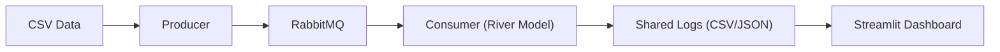
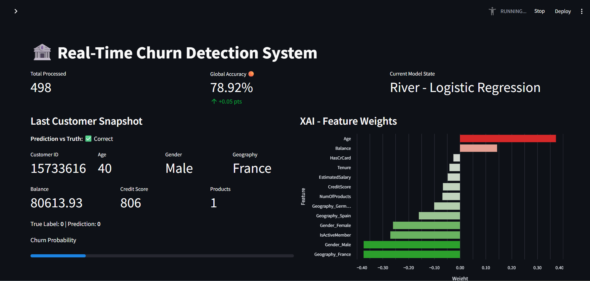

# Real-Time Banking Churn Detection System

[](https://www.python.org/)
[](https://www.docker.com/)
[](https://streamlit.io/)
[](https://www.rabbitmq.com/)
[](LICENSE)
[](#)

Real-time churn detection for banking customers using online (incremental) learning with River. Events stream through RabbitMQ; the consumer learns and explains each decision on the fly, and the Streamlit dashboard visualizes performance and XAI signals in real time.

## Architecture


## Key Features
- Online Learning with River (instance-by-instance updates; no full retrains)
- Real-Time XAI (live feature weights and per-event insight)
- Drift Monitoring via continuous accuracy and probability tracking
- Fully Containerized (Docker Compose for broker, producer, consumer, dashboard)

## Tech Stack
- Python 3.11, River, pandas, numpy
- RabbitMQ + pika
- Streamlit + Altair
- Docker & Docker Compose
- uv for Python dependency management

## Installation & Usage
Prerequisites: Docker and Docker Compose.

1) Start the stack:
```bash
docker compose up --build
```

2) Access points:
- Dashboard: http://localhost:8501
- RabbitMQ UI: http://localhost:15672 (guest / guest by default)

Data source: `data/Churn_Modelling.csv` (mounted read-only into the producer).

## Project Structure
```
real-time-churn-app/
├── consumer/
│   ├── Dockerfile
│   └── main.py
├── producer/
│   ├── Dockerfile
│   └── main.py
├── dashboard/
│   ├── Dockerfile
│   └── main.py
├── data/
│   └── Churn_Modelling.csv
├── docker-compose.yaml
├── requirements.txt
└── README.md
```

## 📸 Dashboard Preview

